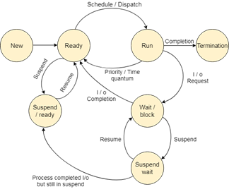

# Scheduling Algorithm

## Terminologies

* **Arrival Time:** Time at which the process arrives at the Ready Queue.
* **Completion Time:** Time at which the process completes its execution.
* **Burst Time:** Time required by a Process for CPU Execution.
* **Turn Around Time:** Time difference between Completion Time and Arrival Time.
* **Waiting Time:** Time difference between Turn Arround Time and Burst Time.
* **Throughput:** Number of tasks executed per unit time.

## Process States

* **New:** When a New Process is created within the Secondary Memory
* **Ready:** The new process is pushed to RAM in the Ready Queue by the Long-Term Scheduler (LTS).
* **Running:** The process is dispatched or scheduled for CPU execution. 
* **Termination:** After the process completes execution, it moves to the Termination stage where all resources allocated to it, are claimed back by the OS.  
* **Wait/Block:** If a process demands I/O, it moves to the Wait/Block stage where it remains in a paused state in RAM until the I/O completes. On completion, it is moved back to the Ready Queue. 
* **Suspend Wait:** If the Wait/Block Queue fills up, then any additional Process is moved to the Suspend wait, where the process is stored into the Secondary Memory until the Wait/Block Queue frees. This is performed by the Medium-Term Scheduler.
* **Suspend/ready:** If there are no more space in the Ready Queue, then a new arriving process is moved to the Suspend ready state where it is kept in the Secondary Memory until the Ready Queue frees up. This is also performed by the Mid Term Scheduler.
* **Backing Store:** If the process completes I/O while staying in the Suspend Wait state and the Wait/Block queue is not free yet, then it is moved to the Suspend Ready State.
* If a new process arrives with a higher priority or the time quantum expires for the current running process, then the new process is dispatched to the running state and the current process is moved back into the Ready Queue. This is non-preemptive task is performed by the Short-Term Scheduler and forms the basis of Multi-tasking OS.

## Types of CPU Scheduling 

* **Preemptive Scheduling:** The resources are allocated to the Process for a limited amount of time and then taken away, placing the process back into the Ready Queue.
* **Non-Preemptive Scheduling:** 

## Different CPU Scheduling Algorithms

* **First Come First Served (FCFS):**
* **Shortest Job First (SJF):**